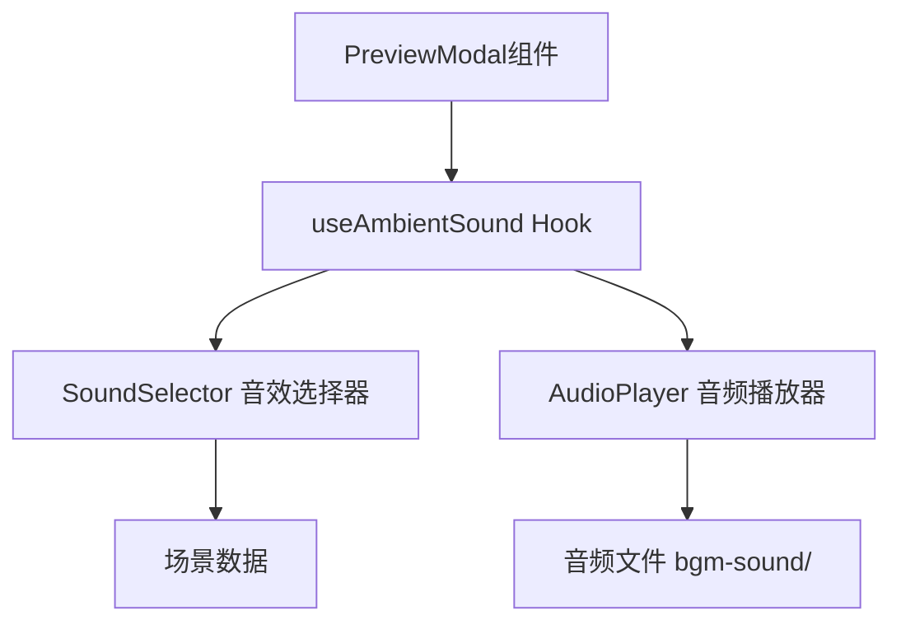

## Product Overview

为现有的城市场景预览应用添加沉浸式背景环境音效功能。当用户进入大图预览模式时，系统根据当前场景的特征（特殊场景、天气状况、地理位置、时间）智能匹配并播放对应的白噪音，提升用户的沉浸式体验。

## Core Features

- **智能音效匹配**：根据场景属性自动选择合适的环境音效
- **优先级音效选择**：按特殊场景 > 风雪天气/极地 > 雨天 > 大城市白天 > 小城市白天 > 夜晚的优先级选择音效
- **自动播放控制**：进入大图预览模式时自动播放，退出时自动停止
- **低音量氛围背景**：默认较小音量，不干扰用户浏览体验

## Tech Stack

- 前端框架：React + TypeScript（沿用现有项目技术栈）
- 音频处理：HTML5 Audio API
- 状态管理：React Hooks

## Architecture Design

### System Architecture

采用模块化设计，将音效功能封装为独立的 Hook 和工具函数。



### Data Flow


### Module Division

1. **useAmbientSound Hook**：核心逻辑，管理音效播放状态
2. **getSoundByScene**：音效选择工具函数，实现优先级匹配逻辑
3. **AudioPlayer**：音频播放控制封装

## Implementation Details

### Core Directory Structure

```
src/
├── hooks/
│   └── useAmbientSound.ts    # 环境音效Hook
├── utils/
│   └── soundSelector.ts       # 音效选择逻辑
└── bgm-sound/                 # 音频文件目录
    ├── special-sound.mp3
    ├── wind-snow-sound.mp3
    ├── rain-sound.mp3
    ├── city-sound.mp3
    ├── country.mp3
    └── night-sound.mp3
```

### Key Code Structures

```typescript
// 音效选择逻辑接口
interface SceneContext {
  sceneName: string;
  weather: string;
  cityType: 'large' | 'small';
  isNight: boolean;
  region?: string;
}

// 音效选择函数
function getSoundByScene(context: SceneContext): string;

// Hook 返回类型
interface UseAmbientSoundReturn {
  isPlaying: boolean;
  volume: number;
  setVolume: (v: number) => void;
}
```

## Agent Extensions

### SubAgent

- **code-explorer**
- Purpose：探索现有项目结构，了解预览组件的实现方式、场景数据结构、以及音频文件的具体位置
- Expected outcome：获取 isExpanded 状态的使用位置、场景数据的字段定义、现有组件结构