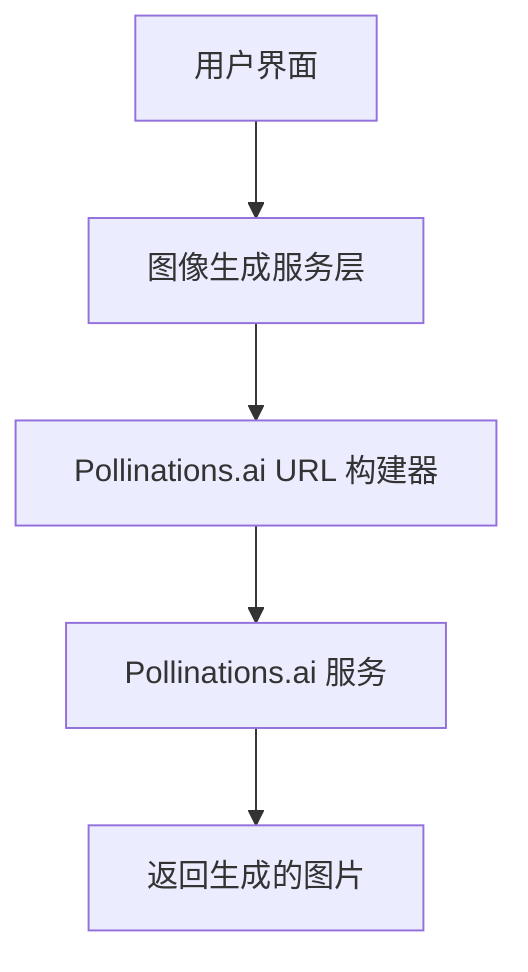
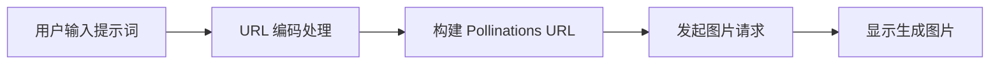

## 产品概述

将现有项目中的 Gemini API 图像生成功能迁移至 Pollinations.ai 免费服务。Pollinations.ai 提供简单的 URL 格式即可生成图片，无需 API Key，降低使用成本并简化集成流程。

## 核心功能

- 移除 Gemini API 相关代码和配置
- 集成 Pollinations.ai 图像生成服务
- 使用 URL 格式 `https://image.pollinations.ai/prompt/{prompt}?params` 生成像素艺术图片
- 保持现有图像生成功能的用户体验一致性
- 支持自定义图片参数（尺寸、风格等）

## 技术方案

### 架构设计

#### 系统架构

采用简单的服务替换模式，将原有的 Gemini API 调用层替换为 Pollinations.ai URL 生成层。



#### 数据流



### 实现细节

#### Pollinations.ai API 格式

```
https://image.pollinations.ai/prompt/{encoded_prompt}?width={width}&height={height}&model={model}&seed={seed}
```

#### 核心参数说明

- `prompt`: URL 编码后的提示词
- `width`: 图片宽度（默认 1024）
- `height`: 图片高度（默认 1024）
- `model`: 生成模型（可选）
- `seed`: 随机种子（可选，用于复现结果）

#### 关键代码结构

```typescript
// Pollinations 图像生成服务
interface PollinationsConfig {
  width?: number;
  height?: number;
  model?: string;
  seed?: number;
}

function generatePollinationsUrl(prompt: string, config?: PollinationsConfig): string {
  const encodedPrompt = encodeURIComponent(prompt);
  const baseUrl = `https://image.pollinations.ai/prompt/${encodedPrompt}`;
  const params = new URLSearchParams();
  
  if (config?.width) params.append('width', config.width.toString());
  if (config?.height) params.append('height', config.height.toString());
  if (config?.model) params.append('model', config.model);
  if (config?.seed) params.append('seed', config.seed.toString());
  
  return params.toString() ? `${baseUrl}?${params}` : baseUrl;
}
```

### 技术考量

#### 优势

- 无需 API Key，降低配置复杂度
- 完全免费，无使用成本
- 简单的 URL 格式，易于集成和调试

#### 注意事项

- 需要处理 URL 编码，确保特殊字符正确转义
- 图片加载可能需要一定时间，建议添加加载状态提示
- 建议添加错误处理机制，应对服务不可用情况

## Agent Extensions

### SubAgent

- **code-explorer**
- 用途：探索现有项目结构，定位 Gemini API 相关代码文件和配置
- 预期结果：找到所有需要修改的文件位置，包括 API 调用代码、配置文件和相关依赖