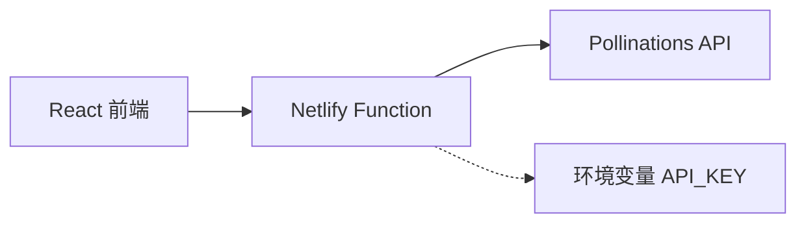

## 产品概述

为现有 React + Vite 前端项目创建 Netlify Serverless Function 代理层，实现 Pollinations API 的安全调用。通过将 API Key 存储在服务端环境变量中，避免前端暴露敏感凭证，同时保持现有图片生成功能的正常运行。

## 核心功能

- 创建 Netlify Serverless Function 作为 API 代理端点
- 安全存储 API Key 在 Netlify 环境变量中
- 代理函数接收前端请求并转发至 Pollinations API
- 改造 Frame.tsx 中的两处 API 调用（第357行和第423行）使用代理端点
- 保持原有图片生成功能的完整性和用户体验

## 技术栈

- **Serverless 函数**: Netlify Functions (Node.js)
- **前端框架**: React + Vite (现有项目)
- **HTTP 客户端**: node-fetch 或原生 fetch
- **环境变量管理**: Netlify 环境变量配置

## 架构设计

### 系统架构

采用代理模式，前端通过 Netlify Function 间接调用 Pollinations API，实现 API Key 的服务端安全存储。



### 数据流

```mermaid
flowchart LR
    User[用户操作] --> Frontend[Frame.tsx]
    Frontend --> Proxy[/.netlify/functions/pollinations-proxy]
    Proxy --> EnvVar[读取 POLLINATIONS_API_KEY]
    Proxy --> API[Pollinations API]
    API --> Proxy
    Proxy --> Frontend
    Frontend --> User
```

## 实现细节

### 目录结构

```
project-root/
├── netlify/
│   └── functions/
│       └── pollinations-proxy.js    # Serverless 代理函数
├── src/
│   └── components/
│       └── Frame.tsx                # 需要改造的组件
├── netlify.toml                     # Netlify 配置
└── .env.example                     # 环境变量示例
```

### 代理函数接口设计

```javascript
// POST /.netlify/functions/pollinations-proxy
// Request Body: { prompt: string, model?: string, width?: number, height?: number, ... }
// Response: { imageUrl: string } 或图片二进制数据
```

### 环境变量配置

- `POLLINATIONS_API_KEY`: Pollinations API 密钥，在 Netlify 控制台配置

## Agent Extensions

### SubAgent

- **code-explorer** (来自 subagent)
- 用途: 探索当前项目结构，定位 Frame.tsx 文件中第357行和第423行的具体 API 调用代码
- 预期结果: 获取需要改造的代码上下文，了解现有 Pollinations API 调用方式和参数结构